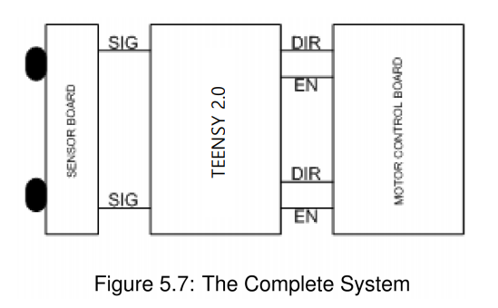
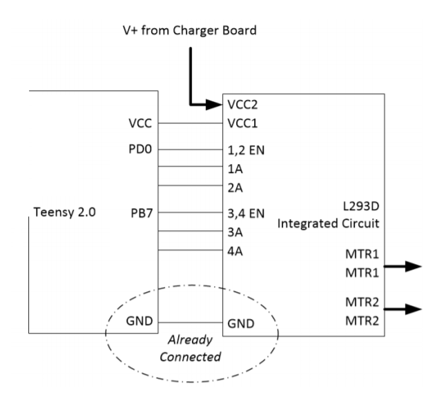
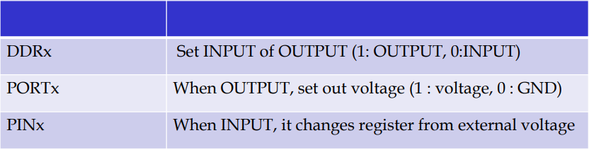

# Basic-Mobile-Lab-1
This repository is for basic mobile lab project 1

## The Structure of Teckbot

## The Circuit of the Main Board

## 2019.05.10
1. We make Tekbot to go forward, by using arduino IDE.
2. We learned how to initialize the pins and make them run by loop statement.
3. We added the switch fuction(Pull-Up-Mode).

## 2019.05.17
1. We learned how to connect the main board to computer in AVR studio.
2. We have to make file in ATmega32U4.
3. Attatched the file which references the previous arduino code.

### Initialization

## 2019.05.27
1. Prototype attaached.
2. Added Start and Stop fuctions.
3. Added Function of directions (Forward, Backward, Left, Right).
4. Atached headerfiles --> Global.h, Sound.h
5. Added comments
