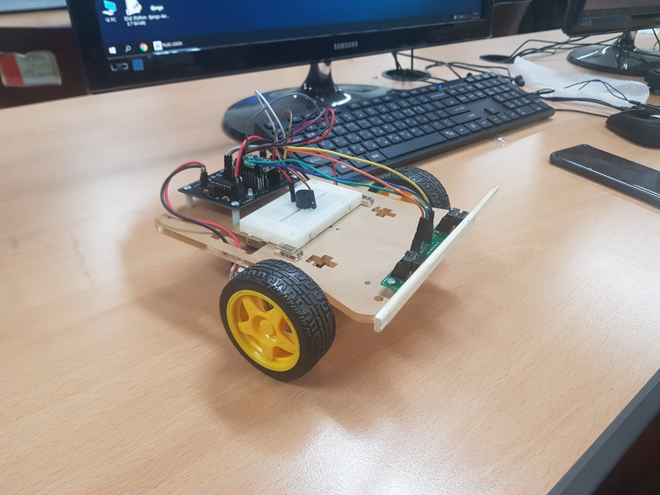
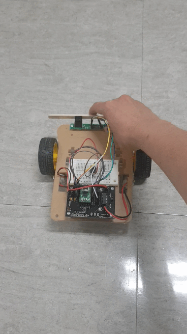
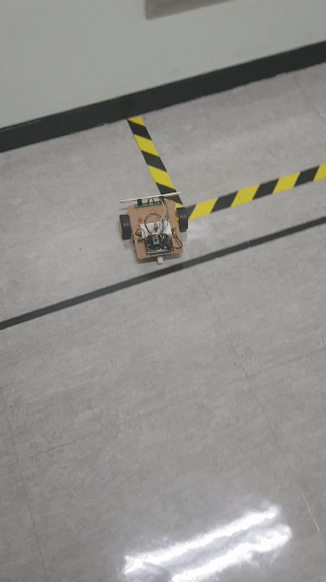
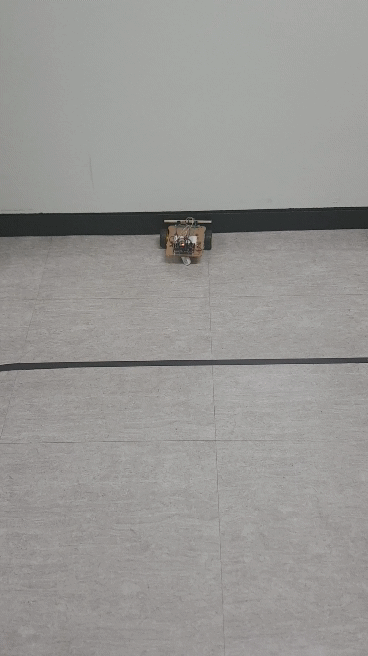
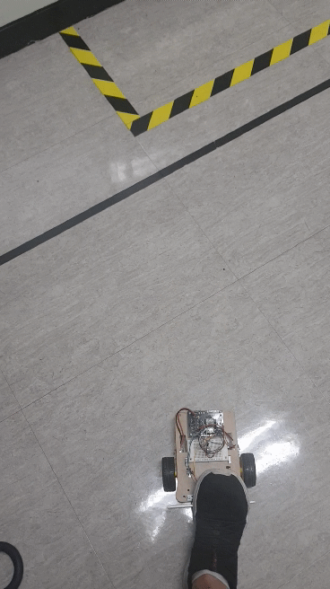

# Basic-Mobile-Lab-1
This repository is for basic mobile lab project 1

## Project finished!
Thanks for my co-worker Yongkwan Park. We have finished our first lab project! ChangYoon 2019.06.06

## Photos of the TekBot

# TekBot 
2019/3 ~ 6, we had class 'Basic Mobile Project 1". Here, we have done a project which contains a robot that detects collision and changes direction.

## AVR
Function **Main** is a code for collision detection. The function **init** sets up the pin of each registers which take care of motor, interrupt, PWM ... etc. In **Direction**, functions fix data by changing each pin separately. In **Sound**, it stores sound functions for each action such as forward, backward ... etc

### Short summary for the main code
* Interrupt
  * If blink_led = 1, then TekBot turns led on for 1 sec. 

* If both buttons are pushed at the same time (in the beginning)
  * Alerts StartSound() .
  * Enables both EN_Pins of motors.
  * EN++ --> EN is the variable that makes a distinction between beginnig and after it.
  
* After EN++
  * If both buttons are not cllicked
    * Go forward
  
  * If right button is clicked
    * Stop
    * Alerts LeftSound()
    * Go backward
    * Turn left for 90 degree (approximately)
    * blink_led++ --> variable that controls the led in timer interrupt
    
  * If left button is cliked
    * Stop
    * Alerts RightSound()
    * Go backward
    * Turn right for 90 degree (approximately)
    * blink_led++ 
   
  * If both buttons are clicked
    * Stop
    * Alerts BothSound()
    * Go backward
    * Turn right for 180 degree (approximately)
    * blink_led++
   
## Testing 
After testing, TekBot worked well. Thanks for everbody for helping us to finish this project. 

**Start TekBot by pushing both button**

**When left button is clicked**

**When right button is clicked**

**When both buttons are clicked**

 
